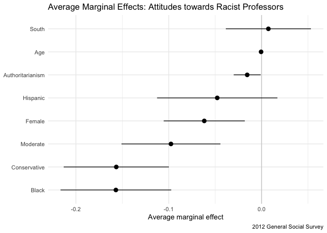

Predicting attitudes towards racist college professors
================
Ojaswi Malik
2020-05-26

## Setup

``` r
#loading the data
gss_data <- rcfss::gss_colrac

#convert colrac to binary
gss_data <- gss_data %>%
  mutate(colrac = as.numeric(colrac))
```

## 1\. Plotting Average Marginal Effects

In my analysis I want to see the effect of a few variables collected
from the General Social Survey poll on answering the question: “should
racist professors be allowed to teach?” I will begin by first plotting
the average marginal effect of these specific variables (namely age,
black, south, authoritarianism, social\_cons3, hispanic\_2 and sex)
using the margins package to visualize the logistic regression estimates
and confidence intervals.

``` r
# estimate logistic regression model using glm()
gss_logit_mod <- glm(
  colrac ~ age + black + south + authoritarianism + social_cons3 + hispanic_2 + sex,
  family = "binomial",
  data = gss_data
)

# Plot the average marginal effect of each variable using the margins package
# to visualize the logistic regression estimates and confidence intervals.
## estimate marginal effects
gss_logit_marg <- margins(gss_logit_mod)

## extract average marginal effects
gss_logit_marg_tbl <- summary(gss_logit_marg) %>%
  as_tibble() %>%
  mutate(factor = recode(
    factor,
    "southSouth" = "South",
    "age" = "Age",
    "authoritarianism" = "Authoritarianism",
    "hispanic_2Yes" = "Hispanic",
    "sexFemale" = "Female",
    "social_cons3Mod" = "Moderate",
    "social_cons3Conserv" = "Conservative",
    "blackYes" = "Black"
  ))

## plot using ggplot()
ggplot(data = gss_logit_marg_tbl,
       mapping = aes(x = reorder(factor, AME),
                     y = AME,
                     ymin = lower,
                     ymax = upper)) +
  # add line indicating null (0) effect
  geom_hline(yintercept = 0, color = "gray80") +
  # add point range plot to visualize estimate and confidence interval
  geom_pointrange() +
  coord_flip() +
  labs(x = NULL,
       y = "Average marginal effect")
```

<!-- -->

**Observation 1.**: From the above graph and from my understanding of
AME:

  - On average if the respondent is black, there is a negative value.
    This implies a black respondent is more likely to believe racist
    professors should not be allowed to teach. This is true for majority
    of the variables considered as seen in the graph such as
    conservatives etc.

  - On average if the respondent is from the South, there is a ~1%
    probability of believing racist professors should be allowed to
    teach compared to if you were not from the south. Although,
    extremely small, this value is the highest considering all other
    variables in this particular analysis

In the following analyses, I will explore these variables in further
details and their interaction with each other.

## 2\. Using only Age to make predictions

In this analysis I will estimate a logistic regression model of whether
or not an individual believes a racist professor should be allowed to
teach with ‘age’ as the predictor. I will estimate predicted
probabilities and plot the logistic regression line using ggplot.

``` r
#estimating the model
age_model <- glm(colrac ~ age, data = gss_data,
                family = binomial)

#present as a tidy table
tidy(age_model) %>%
  kable()
```

| term        |    estimate | std.error |  statistic |   p.value |
| :---------- | ----------: | --------: | ---------: | --------: |
| (Intercept) |   0.1562636 | 0.1309597 |   1.193218 | 0.2327839 |
| age         | \-0.0040416 | 0.0025525 | \-1.583375 | 0.1133360 |

``` r
#estimating the predicted probabilities
age_data <- augment(age_model,
                     newdata = data_grid(gss_data, age),
                     type.predict = "response")

#graphing the line
ggplot(age_data, aes(age, .fitted)) +
  geom_line() +
  labs(title = "Relationship between age and attitudes towards racist college professors",
       y = "Predicted Probability of allowing racist prof. to teach",
       x = "Age") +
  scale_y_continuous(limits = c(0, 1))
```

<!-- -->

``` r
# Predicting the accuracy of the above model
age_model_accuracy <- augment(age_model, type.predict = "response") %>%
  mutate(.pred = as.numeric(.fitted > .5))
    
(age_model_err <- mean(age_model_accuracy$colrac != age_model_accuracy$.pred,
                      na.rm = TRUE))
```

    ## [1] 0.4934144

**Observation 2.**: From the above graph, we can observe that there is a
negative correlation between age and attitude towards allowing racist
professors to teach. This means that older individuals believe there is
less probability for racist professors to teach.

Although the p-value \> 0.05 making it statistically significant, the
significance of this correlation is still quite low. Moreover, The above
model has an error rate of 49.3%. This is a very high error rate and
hence we need to construct other
models.

## 3\. Using respondent’s age and race (African American) as interactive predictors

``` r
#estimating the model
age_black_model <- glm(colrac ~ age * black, data = gss_data,
                family = binomial)

#present as a tidy table
tidy(age_black_model) %>%
  mutate(term = recode(
    term,
    age = "Age",
    blackYes = "Black",
    "age:blackYes" = "Age * Black"
  )) %>%
  kable()
```

| term         |    estimate | std.error |  statistic |   p.value |
| :----------- | ----------: | --------: | ---------: | --------: |
| (Intercept)  |   0.3732911 | 0.1421185 |   2.626619 | 0.0086238 |
| Age          | \-0.0064546 | 0.0027474 | \-2.349383 | 0.0188045 |
| Black        | \-1.3619456 | 0.3921132 | \-3.473348 | 0.0005140 |
| Age \* Black |   0.0150750 | 0.0078098 |   1.930267 | 0.0535738 |

``` r
#estimating the predicted probabilities
age_black_data <- augment(age_black_model,
                     newdata = data_grid(gss_data, age, black),
                     type.predict = "response")

#graphing the line
ggplot(age_black_data, aes(age, .fitted, color = black)) +
  geom_line() +
  labs(title = "Relationship between age and attitudes towards racist college professors",
       subtitle = "Interactive",
       y = "Predicted Probability of allowing racist prof. to teach",
       x = "Age",
       color = "If race is black:") +
  scale_y_continuous(limits = c(0, 1))
```

<!-- -->

``` r
#calculating the error
age_black_model_accuracy <- augment(age_black_model, type.predict = "response") %>%
  mutate(.pred = as.numeric(.fitted > .5))
    
(age_black_model_err <- mean(age_black_model_accuracy$colrac != age_black_model_accuracy$.pred,
                      na.rm = TRUE))
```

    ## [1] 0.4483283

**Observation 3.**: This model shows that young respondents who are
black believe that racist professors have a less probability of being
allowed to teach. This is contrast with young respondents who are not
black. However this gap in different opinions reduces with increase in
age. Hence, old respondents at the age of ~90 have the same attitude
towards racist professors.

This may be explained by young African Americans’ lower tolerance
towards racist professors and demanding a change, as compared to their
older counterparts somewhat accepting this racial bias as a bitter
reality. However, the error rate of this model is 44.8%. Although lower
than the previous model, there is still room for
improvement.

## 4\. Using respondent’s age and race (Hispanic) as interactive predictors

``` r
#estimating the model
age_hispanic_model <- glm(colrac ~ age * hispanic_2, data = gss_data,
                family = binomial)

#present as a tidy table
tidy(age_hispanic_model) %>%
  mutate(term = recode(
    term,
    age = "Age",
    hispanic_2Yes = "Hispanic",
    "age:hispanic_2Yes" = "Age * Hispanic"
  )) %>%
  kable()
```

| term            |    estimate | std.error |  statistic |   p.value |
| :-------------- | ----------: | --------: | ---------: | --------: |
| (Intercept)     |   0.3252706 | 0.1434254 |   2.267873 | 0.0233369 |
| Age             | \-0.0069482 | 0.0027361 | \-2.539428 | 0.0111034 |
| Hispanic        | \-1.1448340 | 0.3884552 | \-2.947145 | 0.0032072 |
| Age \* Hispanic |   0.0227650 | 0.0087142 |   2.612409 | 0.0089907 |

``` r
#estimating the predicted probabilities
age_hispanic_data <- augment(age_hispanic_model,
                     newdata = data_grid(gss_data, age, hispanic_2),
                     type.predict = "response")

#graphing the line
ggplot(age_hispanic_data, aes(age, .fitted, color = hispanic_2)) +
  geom_line() +
  labs(title = "Relationship between age and attitudes towards racist college professors",
       subtitle = "Interactive",
       y = "Predicted Probability of allowing racist prof. to teach",
       x = "Age",
       color = "If Hispanic:") +
  scale_y_continuous(limits = c(0, 1))
```

<!-- -->

``` r
#calculating the error
age_hispanic_model_accuracy <- augment(age_hispanic_model, type.predict = "response") %>%
  mutate(.pred = as.numeric(.fitted > .5))
    
(age_hispanic_model_err <- mean(age_hispanic_model_accuracy$colrac != age_hispanic_model_accuracy$.pred,
                      na.rm = TRUE))
```

    ## [1] 0.4665653

**Observation 4.**: This graph shows an interesting relationship between
age and hispanics on their attitudes towards racist professors. Younger
Hispanics believe there is a less chance for racist professors to be
allowed to teach when compared to other young non-hispanics. However,
with increasing age, older Hispanics believe there is a higher chance
for racist professors to be allowed to teach when compared to other
older non-hispanics.

Although, age and hispanics have negative coefficients, the interactive
relationship between them has a positive coefficient and also a
significant
p-value.

## 5\. Using respondent’s age and social conservatism as interactive predictors

``` r
#estimating the model
age_soc_model <- glm(colrac ~ age * social_cons3, data = gss_data,
                family = binomial)

#present as a tidy table
tidy(age_soc_model) %>%
  mutate(term = recode(
    term,
    age = "Respondent Age",
    social_cons3Mod = "Moderate Social Conservatism",
    social_cons3Conserv = "Conservative Social Conservatism",
    "age:social_cons3Mod" = "Age * Moderate Social Conservatism",
    "age:social_cons3Conserv" = "Age * Conservative Social Conservatism"
  )
) %>%
  kable()
```

| term                                    |    estimate | std.error |   statistic |   p.value |
| :-------------------------------------- | ----------: | --------: | ----------: | --------: |
| (Intercept)                             |   0.0955273 | 0.1986314 |   0.4809276 | 0.6305679 |
| Respondent Age                          |   0.0043021 | 0.0041793 |   1.0293960 | 0.3032936 |
| Moderate Social Conservatism            | \-0.2140634 | 0.3137584 | \-0.6822555 | 0.4950774 |
| Conservative Social Conservatism        | \-0.1147792 | 0.3392712 | \-0.3383112 | 0.7351287 |
| Age \* Moderate Social Conservatism     | \-0.0053125 | 0.0062684 | \-0.8475031 | 0.3967148 |
| Age \* Conservative Social Conservatism | \-0.0120946 | 0.0064796 | \-1.8665657 | 0.0619623 |

``` r
#estimating the predicted probabilities
age_soc_data <- augment(age_soc_model,
                     newdata = data_grid(gss_data, age, social_cons3),
                     type.predict = "response")

#graphing the line
ggplot(age_soc_data, aes(age, .fitted, color = social_cons3)) +
  geom_line() +
  labs(title = "Relationship between age and attitudes towards racist college professors",
       y = "Predicted Probability of allowing racist prof. to teach",
       subtitle = "Interactive",
       x = "Age",
       color = "Social Conservatism Identification:") +
  scale_y_continuous(limits = c(0, 1))
```

<!-- -->

``` r
#calculating the error
age_soc_model_accuracy <- augment(age_soc_model, type.predict = "response") %>%
  mutate(.pred = as.numeric(.fitted > .5))
    
(age_soc_model_err <- mean(age_soc_model_accuracy$colrac != age_soc_model_accuracy$.pred,
                      na.rm = TRUE))
```

    ## [1] 0.4280648

**Observation 5.**: From the above graph, we can ascertain that younger
Moderates and Conservatives have the belief that racist professors have
a less probability of being allowed to teach when compared to Liberals
of the same age. The gap between the belief of Moderates and
Conservatives increases with age, and older conservatives believe racist
professors should have the least probability of allowing racist
professors to teach. This model has a 42.8% error
rate.

## 6\. Using authoritarianism and geographic location as independant variables to make prediction

``` r
#estimating the model
auth_geo_model <- glm(colrac ~ authoritarianism + south, data = gss_data,
                family = binomial)

#present as a tidy table
tidy(auth_geo_model) %>%
  kable()
```

| term             |    estimate | std.error |  statistic |   p.value |
| :--------------- | ----------: | --------: | ---------: | --------: |
| (Intercept)      |   0.3037059 | 0.0887819 |   3.420808 | 0.0006244 |
| authoritarianism | \-0.1222759 | 0.0289120 | \-4.229238 | 0.0000234 |
| southSouth       | \-0.0957382 | 0.0942054 | \-1.016270 | 0.3095006 |

``` r
#estimating the predicted probabilities
auth_geo_data <- augment(auth_geo_model,
                     newdata = data_grid(gss_data, authoritarianism, south),
                     type.predict = "response")

#graphing the line
ggplot(auth_geo_data, aes(authoritarianism, .fitted, color = south)) +
  geom_line() +
  labs(title = "Impact of authoritarianism and location in attitudes towards racist college professors",
       subtitle = "Independantly",
       y = "Predicted Probability of allowing racist prof. to teach",
       x = "Authoritarianism Scale") +
  scale_y_continuous(limits = c(0, 1))
```

<!-- -->

``` r
# Predicting the accuracy of the above model
auth_geo_model_accuracy <- augment(auth_geo_model, type.predict = "response") %>%
  mutate(.pred = as.numeric(.fitted > .5))
    
(auth_geo_model_err <- mean(auth_geo_model_accuracy$colrac != auth_geo_model_accuracy$.pred,
                      na.rm = TRUE))
```

    ## [1] 0.4488349

**Observation 6.**: There is a negative correlation as depicted from the
negative coefficient estimate between authoritarianism and attitudes
towards racist professors. Hence, respondents who are less authoritarian
believe racist professors have a higher chance of being allowed to
teach. However, this result is not statistically significant as the
p-value is less than 5%

People who belong from the south believe that there is less probability
of allowing racist professors to teach as compared to those who do not
belong from the south. The p-value for south is 0.309 which is greater
than 0.05, making it statistically significant.

However, this model has an error of 44.8%. Although lower than before,
we should construct other models
too.

## 7\. Using authoritarianism and geographic location as interactive variables to make prediction

In the previous model, I looked at authoritarianism and geographic
location independantly. In this model, I want to see if there is any
difference from these two variables interacting.

``` r
#estimating the interactive model
auth_geo_model_interactive <- glm(colrac ~ authoritarianism * south, data = gss_data,
                family = binomial)

#present as a tidy table
tidy(auth_geo_model_interactive) %>%
  mutate(term = recode(
    term,
    "authoritarianism:southSouth" = "Interaction: Authoritarianism and South"
  )) %>%
  kable() 
```

| term                                    |    estimate | std.error |   statistic |   p.value |
| :-------------------------------------- | ----------: | --------: | ----------: | --------: |
| (Intercept)                             |   0.2639845 | 0.1036074 |   2.5479309 | 0.0108364 |
| authoritarianism                        | \-0.1053597 | 0.0367854 | \-2.8641702 | 0.0041810 |
| southSouth                              |   0.0185109 | 0.1808183 |   0.1023727 | 0.9184608 |
| Interaction: Authoritarianism and South | \-0.0440802 | 0.0595544 | \-0.7401665 | 0.4591990 |

``` r
#estimating the predicted probabilities
auth_geo_data_interactive <- augment(auth_geo_model_interactive,
                     newdata = data_grid(gss_data, authoritarianism, south),
                     type.predict = "response")

#graphing the line
ggplot(auth_geo_data_interactive, aes(authoritarianism, .fitted, color = south)) +
  geom_line() +
  labs(title = "Impact of authoritarianism and location in attitudes towards racist college professors",
       subtitle = "Interactive",
       y = "Predicted Probability of allowing racist prof. to teach",
       x = "Authoritarianism Scale") +
  scale_y_continuous(limits = c(0, 1))
```

<!-- -->

**Observation 7.**: In this model, the p-value for the interaction
between Authoritarianism and South is 0.45 which makes statistically
significant. There is a negative coefficient indicating the negative
relationship observed the graph. Interestingly, different from the above
graph, respondents with very low authoritarianism from the south believe
racist professors have a higher chance of being allowed to teach.
Otherwise the results are similiar to the previous model, only that the
gap between the Southerners and Non-Southerns increases as
authoritarianism of respondents increases.

## Conclusion

In the report, I looked at the variables age, black, south,
authoritarianism, social conservatism, hispanic and sex to understand
their impact on respondents’ attitudes towards racist professors.

  - In the AME (Average Marginal Effect) analysis, we saw a black
    respondent is more likely to believe racist professors should not be
    allowed to teach. Moreover, young respondents who are black believe
    that racist professors have a less probability of being allowed to
    teach. However this gap in different opinions reduces with increase
    in age. Hence, old respondents at the age of ~90 have the same
    attitude towards racist professors, regardless of being black or
    not.

  - Considering only age, older individuals believe there is less
    probability for racist professors to teach.

  - Younger Hispanics believe there is a less chance for racist
    professors to be allowed to teach when compared to other young
    non-hispanics. However, with increasing age, older Hispanics believe
    there is a higher chance for racist professors to be allowed to
    teach when compared to other older non-hispanics.

  - Younger Moderates and Conservatives have the belief that racist
    professors have a less probability of being allowed to teach when
    compared to Liberals of the same age. The gap between the belief of
    Moderates and Conservatives increases with age, and older
    conservatives believe racist professors should have the least
    probability of allowing racist professors to teach.

  - In an interactive model between Authoritarianism and Southern
    location, respondents with very low authoritarianism from the south
    believe racist professors have a higher chance of being allowed to
    teach, Moreover, the gap between the Southerners and Non-Southerns
    increases as authoritarianism of respondents
    increases.

## Session info

``` r
devtools::session_info()
```

    ## ─ Session info ───────────────────────────────────────────────────────────────
    ##  setting  value                       
    ##  version  R version 3.6.3 (2020-02-29)
    ##  os       macOS Catalina 10.15.4      
    ##  system   x86_64, darwin15.6.0        
    ##  ui       X11                         
    ##  language (EN)                        
    ##  collate  en_US.UTF-8                 
    ##  ctype    en_US.UTF-8                 
    ##  tz       Asia/Kolkata                
    ##  date     2020-05-26                  
    ## 
    ## ─ Packages ───────────────────────────────────────────────────────────────────
    ##  package     * version  date       lib source                        
    ##  assertthat    0.2.1    2019-03-21 [1] CRAN (R 3.6.0)                
    ##  backports     1.1.6    2020-04-05 [1] CRAN (R 3.6.2)                
    ##  broom       * 0.5.5    2020-02-29 [1] CRAN (R 3.6.0)                
    ##  callr         3.4.3    2020-03-28 [1] CRAN (R 3.6.2)                
    ##  cellranger    1.1.0    2016-07-27 [1] CRAN (R 3.6.0)                
    ##  cli           2.0.2    2020-02-28 [1] CRAN (R 3.6.0)                
    ##  colorspace    1.4-1    2019-03-18 [1] CRAN (R 3.6.0)                
    ##  crayon        1.3.4    2017-09-16 [1] CRAN (R 3.6.0)                
    ##  data.table    1.12.8   2019-12-09 [1] CRAN (R 3.6.0)                
    ##  DBI           1.1.0    2019-12-15 [1] CRAN (R 3.6.0)                
    ##  dbplyr        1.4.3    2020-04-19 [1] CRAN (R 3.6.3)                
    ##  desc          1.2.0    2018-05-01 [1] CRAN (R 3.6.0)                
    ##  devtools      2.3.0    2020-04-10 [1] CRAN (R 3.6.3)                
    ##  digest        0.6.25   2020-02-23 [1] CRAN (R 3.6.0)                
    ##  dplyr       * 0.8.5    2020-03-07 [1] CRAN (R 3.6.0)                
    ##  ellipsis      0.3.0    2019-09-20 [1] CRAN (R 3.6.0)                
    ##  evaluate      0.14     2019-05-28 [1] CRAN (R 3.6.0)                
    ##  fansi         0.4.1    2020-01-08 [1] CRAN (R 3.6.0)                
    ##  farver        2.0.3    2020-01-16 [1] CRAN (R 3.6.0)                
    ##  forcats     * 0.5.0    2020-03-01 [1] CRAN (R 3.6.0)                
    ##  fs            1.4.1    2020-04-04 [1] CRAN (R 3.6.2)                
    ##  generics      0.0.2    2018-11-29 [1] CRAN (R 3.6.0)                
    ##  ggplot2     * 3.3.0    2020-03-05 [1] CRAN (R 3.6.0)                
    ##  glue          1.4.0    2020-04-03 [1] CRAN (R 3.6.2)                
    ##  gtable        0.3.0    2019-03-25 [1] CRAN (R 3.6.0)                
    ##  haven         2.2.0    2019-11-08 [1] CRAN (R 3.6.0)                
    ##  highr         0.8      2019-03-20 [1] CRAN (R 3.6.0)                
    ##  hms           0.5.3    2020-01-08 [1] CRAN (R 3.6.0)                
    ##  htmltools     0.4.0    2019-10-04 [1] CRAN (R 3.6.0)                
    ##  httr          1.4.1    2019-08-05 [1] CRAN (R 3.6.0)                
    ##  jsonlite      1.6.1    2020-02-02 [1] CRAN (R 3.6.0)                
    ##  knitr       * 1.28     2020-02-06 [1] CRAN (R 3.6.0)                
    ##  labeling      0.3      2014-08-23 [1] CRAN (R 3.6.0)                
    ##  lattice       0.20-38  2018-11-04 [1] CRAN (R 3.6.3)                
    ##  lifecycle     0.2.0    2020-03-06 [1] CRAN (R 3.6.0)                
    ##  lubridate     1.7.8    2020-04-06 [1] CRAN (R 3.6.2)                
    ##  magrittr      1.5      2014-11-22 [1] CRAN (R 3.6.0)                
    ##  margins     * 0.3.23   2018-05-22 [1] CRAN (R 3.6.0)                
    ##  MASS          7.3-51.5 2019-12-20 [1] CRAN (R 3.6.3)                
    ##  memoise       1.1.0    2017-04-21 [1] CRAN (R 3.6.0)                
    ##  modelr      * 0.1.6    2020-02-22 [1] CRAN (R 3.6.0)                
    ##  munsell       0.5.0    2018-06-12 [1] CRAN (R 3.6.0)                
    ##  nlme          3.1-144  2020-02-06 [1] CRAN (R 3.6.3)                
    ##  pillar        1.4.3    2019-12-20 [1] CRAN (R 3.6.0)                
    ##  pkgbuild      1.0.6    2019-10-09 [1] CRAN (R 3.6.0)                
    ##  pkgconfig     2.0.3    2019-09-22 [1] CRAN (R 3.6.0)                
    ##  pkgload       1.0.2    2018-10-29 [1] CRAN (R 3.6.0)                
    ##  prediction    0.3.14   2019-06-17 [1] CRAN (R 3.6.0)                
    ##  prettyunits   1.1.1    2020-01-24 [1] CRAN (R 3.6.0)                
    ##  processx      3.4.2    2020-02-09 [1] CRAN (R 3.6.0)                
    ##  ps            1.3.2    2020-02-13 [1] CRAN (R 3.6.0)                
    ##  purrr       * 0.3.4    2020-04-17 [1] CRAN (R 3.6.2)                
    ##  R6            2.4.1    2019-11-12 [1] CRAN (R 3.6.0)                
    ##  rcfss       * 0.1.9    2020-04-19 [1] Github (uc-cfss/rcfss@6dd8d8b)
    ##  Rcpp          1.0.4.6  2020-04-09 [1] CRAN (R 3.6.3)                
    ##  readr       * 1.3.1    2018-12-21 [1] CRAN (R 3.6.0)                
    ##  readxl        1.3.1    2019-03-13 [1] CRAN (R 3.6.0)                
    ##  remotes       2.1.1    2020-02-15 [1] CRAN (R 3.6.0)                
    ##  reprex        0.3.0    2019-05-16 [1] CRAN (R 3.6.0)                
    ##  rlang         0.4.5    2020-03-01 [1] CRAN (R 3.6.0)                
    ##  rmarkdown     2.1      2020-01-20 [1] CRAN (R 3.6.0)                
    ##  rprojroot     1.3-2    2018-01-03 [1] CRAN (R 3.6.0)                
    ##  rstudioapi    0.11     2020-02-07 [1] CRAN (R 3.6.0)                
    ##  rvest         0.3.5    2019-11-08 [1] CRAN (R 3.6.0)                
    ##  scales        1.1.0    2019-11-18 [1] CRAN (R 3.6.0)                
    ##  sessioninfo   1.1.1    2018-11-05 [1] CRAN (R 3.6.0)                
    ##  stringi       1.4.6    2020-02-17 [1] CRAN (R 3.6.0)                
    ##  stringr     * 1.4.0    2019-02-10 [1] CRAN (R 3.6.0)                
    ##  testthat      2.3.2    2020-03-02 [1] CRAN (R 3.6.0)                
    ##  tibble      * 3.0.0    2020-03-30 [1] CRAN (R 3.6.2)                
    ##  tidyr       * 1.0.2    2020-01-24 [1] CRAN (R 3.6.0)                
    ##  tidyselect    1.0.0    2020-01-27 [1] CRAN (R 3.6.0)                
    ##  tidyverse   * 1.3.0    2019-11-21 [1] CRAN (R 3.6.0)                
    ##  usethis       1.6.0    2020-04-09 [1] CRAN (R 3.6.3)                
    ##  vctrs         0.2.4    2020-03-10 [1] CRAN (R 3.6.0)                
    ##  withr         2.1.2    2018-03-15 [1] CRAN (R 3.6.0)                
    ##  xfun          0.13     2020-04-13 [1] CRAN (R 3.6.2)                
    ##  xml2          1.3.1    2020-04-09 [1] CRAN (R 3.6.2)                
    ##  yaml          2.2.1    2020-02-01 [1] CRAN (R 3.6.0)                
    ## 
    ## [1] /Library/Frameworks/R.framework/Versions/3.6/Resources/library
